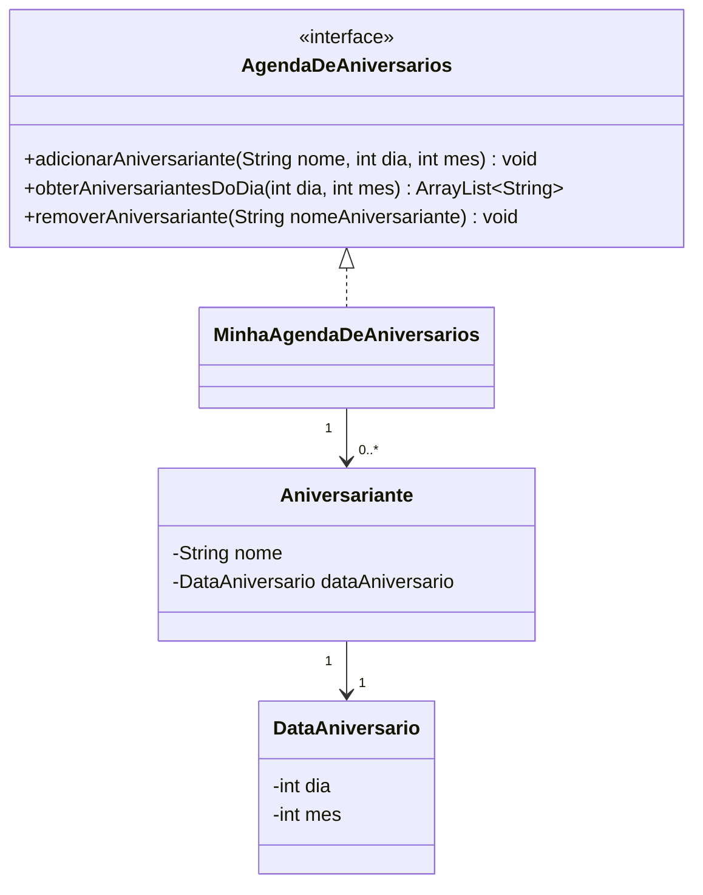

# Exercicio 1 - Agenda de Aniversarios

Solução da atividade usando Java.

## Classes

- `AgendaDeAniversarios`: interface com os métodos da agenda.
- `MinhaAgendaDeAniversarios`: classe concreta que guarda a lista de aniversariantes.
- `Aniversariante`: representa uma pessoa aniversariante.
- `DataAniversario`: representa o dia e o mês do aniversário.

## Diagrama

